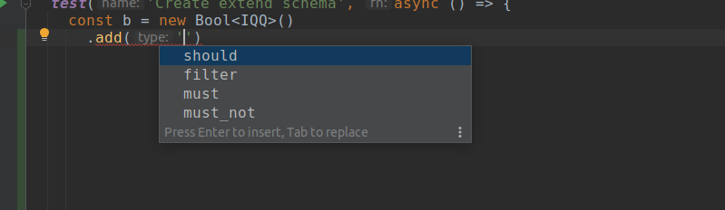
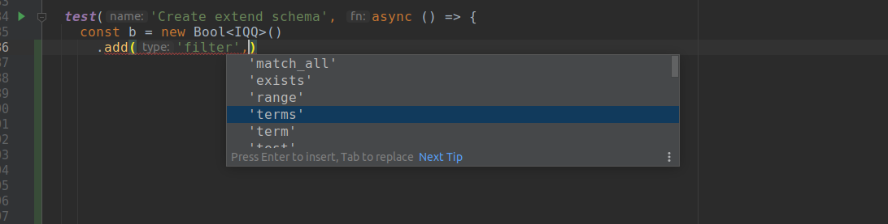
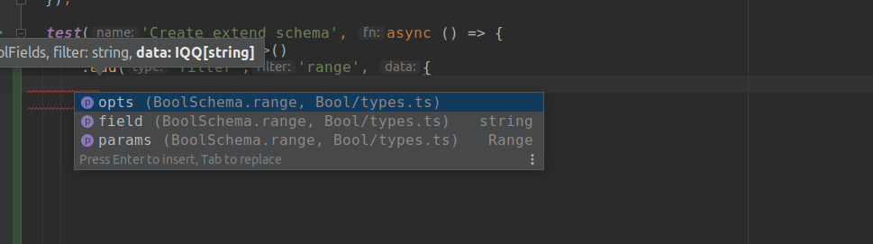
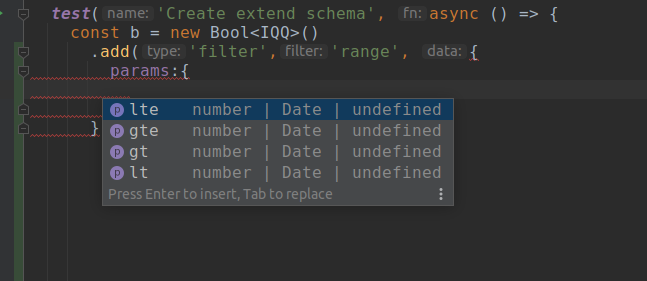
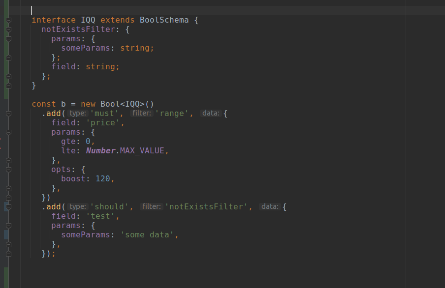

### Typescript implementation of the ElasticSearch query DSL

##### Support :

- nested
- script_fields
- bool
- query
- aggregations (in progress...)

**Generating hints based on types :**

**Based on the selected, the context of the prompts changes :**

**After selecting the filter type, it shows options for a specific**


---



---

Not all fields are currently implemented. But you can extend the support yourself in your code.\*\*\*


**Advanced exapmles in **tests** directory**

###### example:

```typescript
import { Bool, Query } from '../../index';

const q = new Query()
  .addProps('_source', ['field'])
  .addProps('explain', true)
  .addProps('from', 0)
  .addProps('size', 100)
  .addProps('q', 'Lucene query string ')
  .addQuery('match', {
    message: {
      query: 'query',
    },
  })
  .addQuery('term', {
    field: 'f',
    value: 'term',
  })
  .addQuery('range', {
    gt: 0,
    gte: 0,
  });

q.bool.addBuilder(
  'must',
  new Bool().add('must', 'term', {
    field: 'articul',
    params: {
      value: '111',
    },
  }),
);
```

###### result :

```json
{
  "_source": ["field"],
  "explain": true,
  "from": 0,
  "q": "Lucene query string ",
  "query": {
    "bool": {
      "must": [
        {
          "bool": {
            "must": [
              {
                "term": {
                  "articul": {
                    "value": "111"
                  }
                }
              }
            ]
          }
        }
      ]
    },
    "match": {
      "message": {
        "query": "query"
      }
    },
    "range": {
      "gt": 0,
      "gte": 0
    },
    "term": {
      "field": "f",
      "value": "term"
    }
  },
  "size": 100
}
```

#### TEST

```bash
npm run test
```
